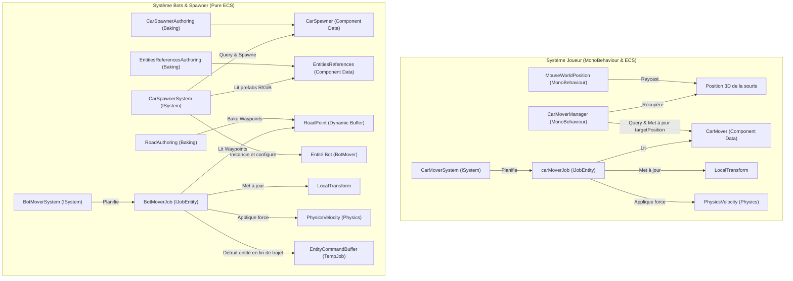

# Unity ECS - Simulation de Trafic & Système de Navigation par Waypoints

Ce projet est une démonstration technique de simulation de trafic développée sur **Unity** utilisant la stack technologique orientée données (**DOTS**), et plus particulièrement **Unity Entities (ECS)** et **Unity Physics** (version `1.4.5`).

L'objectif principal est de concevoir un système hautement performant de génération et de guidage de véhicules :
1. **Véhicules contrôlés (Point & Click)** : Guidage dynamique par clic de souris sur un plan horizontal.
2. **Véhicules autonomes (Bots spawner)** : Génération automatique de bots colorés se déplaçant le long de tracés complexes définis par des waypoints.

---

## 🏗️ Architecture Technique & Data-Oriented Design

Le projet repose sur la séparation stricte des données et des comportements préconisée par l'architecture Entity Component System (ECS) :

---

## 🗂️ Structure et Fichiers du Projet

Voici l'organisation détaillée du code source du projet. Chaque script est lié ci-dessous pour un accès rapide.

### 1. Composants d'Authoring et de Baking (Conversion GameObject → ECS)
Ces scripts résident dans le dossier [`Assets/Scripts/Authoring`](Assets/Scripts/Authoring) et permettent de configurer les données dans l'Éditeur Unity avant de les convertir en entités ECS.

*   [`BotMoverAuhoring.cs`](Assets/Scripts/Authoring/BotMoverAuhoring.cs) :
    *   Définit le composant d'authoring `BotMoverAuthoring` et sa classe de baking associée.
    *   Déclare la structure de données `BotMover` (`IComponentData`) contenant la vitesse (`moveSpeed`), la vitesse de rotation (`rotationSpeed`), la référence à l'entité route (`Road`), et l'index du waypoint actuel (`currentWaypointIndex`).
*   [`CarMoverAuthoring.cs`](Assets/Scripts/Authoring/CarMoverAuthoring.cs) :
    *   Définit le composant d'authoring `CarMoverAuthoring` et sa classe de baking.
    *   Déclare la structure `CarMover` (`IComponentData`) qui stocke la vitesse, la vitesse de rotation et la position cible (`targetPosition`) du joueur.
*   [`CarSpawnerAuthoring.cs`](Assets/Scripts/Authoring/CarSpawnerAuthoring.cs) :
    *   Définit le spawner de voitures `CarSpawnerAuthoring`.
    *   Déclare `CarSpawner` (`IComponentData`) pour gérer le chronomètre de spawn (`timer`, `timerMax`), les paramètres des bots (`botMoveSpeed`, `botRotationSpeed`), et l'entité route cible.
*   [`EntitiesReferencesAuthoring.cs`](Assets/Scripts/Authoring/EntitiesReferencesAuthoring.cs) :
    *   Permet de référencer des GameObjects Prefabs (voitures rouge, verte, bleue) et de les baker en entités utilisables à chaud par les systèmes d'instanciation (`EntitiesReferences`).
*   [`RoadAuthoring.cs`](Assets/Scripts/Authoring/RoadAuthoring.cs) :
    *   Définit une liste de points de passage (`Waypoints`) sous forme de `Transform[]` Unity.
    *   Dessine les lignes de Gizmos jaunes dans l'éditeur pour visualiser les tracés de route.
    *   Bake le tableau de positions Unity en un `DynamicBuffer<RoadPoint>` (`IBufferElementData`) sur l'entité de la route.

### 2. Systèmes ECS (Logique Runtime)
Ces systèmes gèrent le comportement dynamique des entités à chaque frame. Ils sont situés dans le dossier [`Assets/Scripts/Systems`](Assets/Scripts/Systems).

*   [`CarMoverSystem.cs`](Assets/Scripts/Systems/CarMoverSystem.cs) :
    *   Exécute le job parallèle `carMoverJob` (`IJobEntity`) compilé avec Burst.
    *   Gère le déplacement physique fluide de la voiture joueur vers `targetPosition` en orientant l'entité via un quaternion slerp et en lui appliquant une vitesse linéaire `PhysicsVelocity`.
*   [`BotMoverSystem.cs`](Assets/Scripts/Systems/BotMoverSystem.cs) :
    *   Gère le déplacement des bots autonomes à travers les waypoints stockés dans le buffer dynamique.
    *   Utilise `BotMoverJob` (`IJobEntity` compilé avec Burst) s'appuyant sur un `BufferLookup<RoadPoint>` pour lire la route partagée.
    *   Lorsqu'un bot atteint le dernier waypoint, il est détruit de manière thread-safe à l'aide d'un `EntityCommandBuffer.ParallelWriter`.
*   [`CarSpawnerSystem.cs`](Assets/Scripts/Systems/CarSpawnerSystem.cs) :
    *   Gère la génération périodique de bots à l'emplacement du spawner.
    *   Sélectionne aléatoirement un prefab parmi les voitures rouge, verte ou bleue.
    *   Copie dynamiquement sur l'entité instanciée les données de navigation (`Road`, `moveSpeed`, `rotationSpeed`) issues de la configuration du spawner.

### 3. Gestionnaires MonoBehaviour (Interaction & Input)
Scripts classiques situés dans le dossier [`Assets/Scripts/MonoBehaviour`](Assets/Scripts/MonoBehaviour) pour faire le pont entre l'interface utilisateur Unity et le monde ECS.

*   [`MouseWorldPosition.cs`](Assets/Scripts/MonoBehaviour/MouseWorldPosition.cs) :
    *   Singleton détectant la position du curseur de la souris via un lancer de rayon (`Raycast`) projeté de la caméra sur un plan virtuel horizontal.
*   [`CarMoverManager.cs`](Assets/Scripts/MonoBehaviour/CarMoverManager.cs) :
    *   Détecte le clic droit de la souris, interroge l'ECS World (`World.DefaultGameObjectInjectionWorld.EntityManager`) et met à jour en bloc le composant `CarMover` de toutes les voitures contrôlées par le joueur.

---

## ⚙️ Détails et concepts techniques DOTS implémentés

1.  **Baking & Conversion** :
    *   Tous les GameObjects d'authoring sont convertis à l'aide de classes dérivées de `Baker<T>` générant des structures légères implémentant `IComponentData` ou `IBufferElementData`.
2.  **Tampons Dynamiques (`DynamicBuffer`)** :
    *   Plutôt que d'avoir des références à des listes managées d'objets, le tracé de la route est stocké de manière contiguë en mémoire via `DynamicBuffer<RoadPoint>`. Cela garantit un accès cache-friendly ultra rapide pour les jobs de déplacement.
3.  **Compilation Burst & Jobs Multithreadés** :
    *   Les systèmes [`CarMoverSystem`](Assets/Scripts/Systems/CarMoverSystem.cs) et [`BotMoverSystem`](Assets/Scripts/Systems/BotMoverSystem.cs) tirent parti du Job System d'Unity via `IJobEntity`.
    *   L'attribut `[BurstCompile]` compile le code C# en code machine hautement optimisé, éliminant les allocations mémoire managées.
4.  **Changements structurels thread-safe via ECB** :
    *   Dans un environnement parallèle (`IJobEntity`), détruire directement une entité est impossible car cela invaliderait la structure de la mémoire en cours de traitement.
    *   Le `BotMoverSystem` utilise donc un `EntityCommandBuffer` de type `TempJob` avec un `AsParallelWriter()`. Les requêtes de destruction sont enregistrées en parallèle et relues de manière séquentielle sur le thread principal à la fin de la frame via `ecb.Playback()`.

---

## 🛠️ Configuration logicielle requise

Le projet a été validé avec la configuration suivante de dépendances :

| Dépendance | Version | Description / Rôle |
| :--- | :--- | :--- |
| **Unity** | `6000.3.15f1` | Moteur principal avec support complet ECS / DOTS 1.0+ |
| `com.unity.entities` | `1.4.5` | Cœur de l'architecture ECS (Baking, Queries, World) |
| `com.unity.physics` | `1.4.5` | Moteur physique orienté données (`PhysicsVelocity`, `PhysicsMass`) |
| `com.unity.entities.graphics` | `1.4.18` | Rendu performant des entités (Instanced rendering) |
| `com.unity.inputsystem` | `1.19.0` | Gestion moderne des entrées utilisateur |
| `com.unity.ai.navigation` | `2.0.12` | Outils de navigation (utilisables pour le placement de Waypoints) |

---

## 🚀 Comment exécuter le projet ?

1.  **Ouverture du projet** :
    *   Importez le dossier dans **Unity Hub** (version compatible DOTS 1.0+).
    *   Assurez-vous que l'ensemble des packages listés dans le fichier `manifest.json` est correctement installé.
2.  **Configuration de la scène** :
    *   Créez un GameObject doté du composant `EntitiesReferencesAuthoring` pour y assigner vos prefabs de bots (Rouge, Vert, Bleu).
    *   Créez une route en ajoutant des GameObjects enfants à un objet doté du composant `RoadAuthoring`, puis glissez-déposez ces GameObjects dans la liste des waypoints (`Waypoints`).
    *   Configurez un Spawner à l'aide de `CarSpawnerAuthoring` en lui assignant l'objet route, le rythme de génération (`timerMax`), ainsi que les vitesses de déplacement et de rotation souhaitées pour les bots.
    *   Ajoutez un sol physique (avec collisionneur) pour que le moteur physique d'ECS calcule correctement la friction et le déplacement.
3.  **Lancement** :
    *   Passez en mode **Play**.
    *   Le spawner va générer des voitures de couleur aléatoire à intervalles réguliers. Elles suivront la route en passant d'un waypoint à un autre, avant de disparaître à la fin.
    *   Faites un **clic droit** n'importe où dans la scène pour diriger toutes les voitures équipées de `CarMover` vers cette position.

